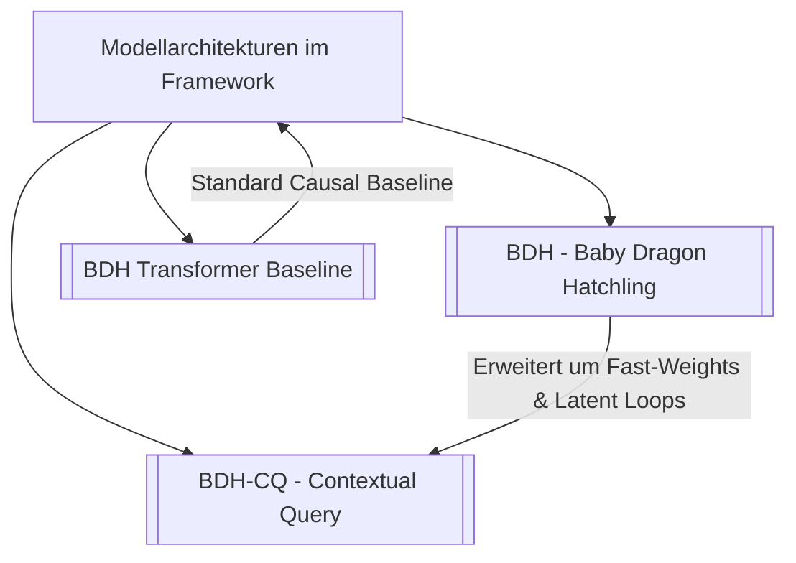

# 🐉 BDH Modell-Dokumentation & Wissensbasis

Willkommen in der Dokumentation für das **BDH-Framework (Baby Dragon Hatchling)**. Dieses Repository implementiert und evaluiert innovative neuronale Netzwerkarchitekturen mit Fokus auf biologisch inspirierte, dünnbesetzte synaptische Verknüpfungen (*sparse synaptogenesis*), assoziative Schnellgewichte (*fast-weights*) und latente Denkprozesse (*recurrent latent reasoning*).

> [!abstract] Kernphilosophie
> Die BDH-Architekturfamilie ersetzt traditionelle dichte Matrixmultiplikationen und explizite KV-Caches durch hochdimensionale dünnbesetzte Repräsentationen, synaptisches Gating und assoziative Schnellgewichte. Dies ermöglicht In-Context Learning mit $O(1)$-Inferenzkomplexität bzgl. Demonstrationen und Skalierung der Denktiefe im latenten Raum ohne diskrete Token-Generierung.

---

## 🗺️ Inhaltsübersicht (Map of Content)

### 🧠 Die Modellarchitekturen

1. **[[BDH - Baby Dragon Hatchling]]**
   - Die biologisch inspirierte Basisarchitektur.
   - Hochdimensionale dünnbesetzte Zwischenrepräsentationen ($N \gg D$).
   - RoPE Linear Attention und Hadamard-Gating ($x \odot y$).
   - Gewichts-Encoder und geteilte Decoder-Projektionen.

2. **[[BDH-CQ - Contextual Query]]**
   - Erweiterung für In-Context Learning & iteratives Schließen.
   - **Assoziativer Demonstrationsspeicher**: Fast-Weights $\boldsymbol{\rho}_{K,l}$ ohne expliziten KV-Cache.
   - **Latenter Workspace**: $R$ rekursente Denk-Iterationen auf kontinuierlichen Vektoren.
   - **Deep Supervision**: Mehrstufige Verlustberechnung mit konfigurierbaren Schedulern (`ramp`, `uniform`, `final_only`).

3. **[[BDH Transformer Baseline]]**
   - Standard Causal Transformer (Pre-LN, RoPE/Positional Embeddings, GELU MLP).
   - Dient als experimentelle Kontrollgruppe und Leistungsbenchmark.

4. **[[Modellvergleich & Benchmarks]]**
   - Detaillierte Gegenüberstellung: Parameter, Speicherkomplexität, Rechenaufwand, Inferenzverhalten und Skalierbarkeit.

---

### 🔬 Zentrale Konzepte & Mechanismen

- **[[Assoziatives Gedächtnis & Fast-Weights]]**: Mathematische Herleitung der Fast-Weight-Akkumulation $\rho_{K,l} = \sum_{\tau} v_\tau x_\tau^T$ und des abrufenden Gedächtnisses.
- **[[Latenter Workspace & Deep Supervision]]**: Rekurrente Denkzyklen ($H_0 \to H_R$), Gradientenstabilität und Test-Time Compute Scaling.
- **[[Halting Head & PonderNet]]**: Adaptive Computation Time (ACT), probabilistisches Halten pro Sample und geometrischer Prior.
- **[[RoPE & Sparse Synaptic Gating]]**: Quantisierte Frequenzverteilungen, Rotary Position Embeddings und ReLU-Aktivierungssparsität.
- **[[LayerNorm & Flaschenhals-Dynamik]]**: Verhinderung von Norm-Explosionen, Kalibrierung für ReLU-Gating (Denoising), Trainingsstabilität und parameterfreie Head-Normalisierung.
- **[[Speicheroptimierung & VRAM-Reduktion]]**: Ursachen des VRAM-Bedarfs, detaillierte Analyse der 6 Optimierungsmethoden (8-Bit AdamW, Lion, Adafactor, Checkpointing, Mixed Precision, Gradient Accumulation) und Best Practices für 16 GB Apple Silicon.

---

## 🚀 Schnellstart & Code-Referenzen

| Modell | Registry Name | Quellcodedatei | Wichtigste Klasse |
| :--- | :--- | :--- | :--- |
| **BDH** | `"bdh"` | `src/model/bdh.py` | `ConfiguredBDH` / `BDH` |
| **BDH-CQ** | `"bdh_cq"` | `src/model/bdh_cq.py` | `ConfiguredBDHCQ` / `BDHCQ` |
| **GPT Baseline** | `"gpt_model"` (`"bdh_transformer"`) | `src/model/bdh.py` | `GPTModel` (`BDHTransformer`) |

> [!tip] Ausführung & Training
> Sämtliche Modelle werden über das Registry-System instanziiert und können über `uv run python main.py --config configs/<config>.yaml` trainiert werden.
