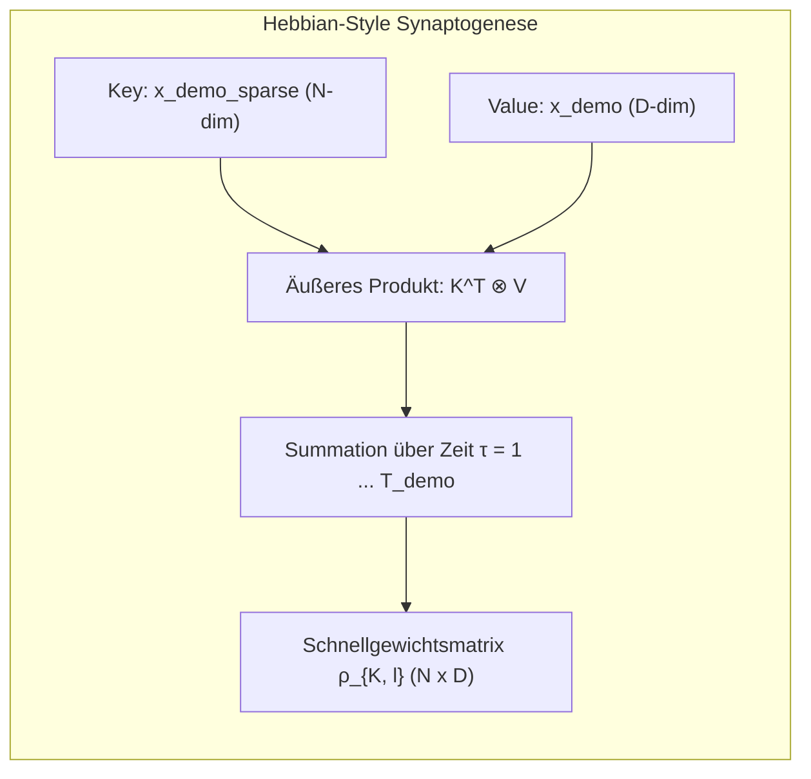
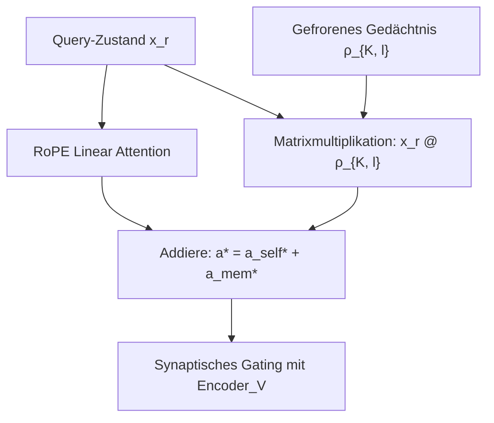

# 🧠 Assoziatives Gedächtnis & Fast-Weights in BDH-CQ

Im klassischen Deep Learning existiert eine strikte Trennung zwischen zwei Zeit- und Anpassungsskalen:
1. **Langsame synaptische Gewichte** ($\theta$): Werden während des Trainings via Backpropagation über Millionen Schritte optimiert und bleiben zur Inferenzzeit starr (statisch).
2. **Schnelle Aktivierungszustände** ($h_t$): Verändern sich mit jedem Token, besitzen jedoch nur sehr begrenzte Speicherkapazität (oder erfordern wachsende KV-Caches).

Das Konzept der **Fast-Weights (Schnellgewichte)** im [[BDH-CQ - Contextual Query\|BDH-CQ]]-Modell schlägt eine Brücke zwischen beiden Welten: Es erzeugt temporäre, assoziative Gewichtsmatrizen, die während der Ingestion von Demonstrationen aufgebaut und für anschließende Abfragen als Gedächtnis verwendet werden.

---

## 📐 Mathematische Herleitung

### 1. Akkumulation der Schnellgewichte ($\boldsymbol{\rho}_{K, l}$)

Sei $T_{demo}$ die Gesamtlänge aller Demonstrationsbeispiele $D = \{(x_t, y_t)\}_{t=1}^K$. Beim Durchlaufen von Layer $l$ entsteht für jeden Zeitschritt $\tau \le T_{demo}$:
- die sparsifizierte Schlüsselrepräsentation $x_{demo\_sparse, \tau, l} \in \mathbb{R}^{n_h \times N}$
- die unkomprimierte Wertrepräsentation $x_{demo, \tau, l} \in \mathbb{R}^{1 \times D}$

Die assoziative Schnellgewichtsmatrix $\boldsymbol{\rho}_{K, l}$ für Layer $l$ akkumuliert das äußere Produkt (Outer Product) über alle Zeitschritte:

$$\boldsymbol{\rho}_{K, l} = \sum_{\tau=1}^{T_{demo}} x_{demo\_sparse, \tau, l}^T \cdot x_{demo, \tau, l} \quad \in \mathbb{R}^{n_h \times N \times D}$$

In PyTorch ausgedrückt (`src/model/bdh_cq.py`):
```python
rho_l = x_demo_sparse.transpose(2, 3) @ x_demo.expand(-1, nh, -1, -1)
```



---

## 🔍 Assoziativer Abruf während der Abfrage (Query Retrieval)

Trifft eine Abfragesequenz $x^\star$ ein, greift das Modell in jedem Layer $l$ und jedem Denkschritt $r$ parallel auf zwei Informationsquellen zu:
1. **Räumliche Selbstaufmerksamkeit ($a_{self}^*$)**: Verknüpft die Tokens der aktuellen Abfrage untereinander mittels RoPE Linear Attention.
2. **Assoziativer Gedächtnisabruf ($a_{mem}^*$)**: Extrahiert relevante Informationen direkt aus der Schnellgewichtsmatrix:

$$a_{mem}^* = x_{r, l} \cdot \boldsymbol{\rho}_{K, l} \quad \in \mathbb{R}^{B \times n_h \times T_{query} \times D}$$

Die beiden Signale werden addiert:
$$a^* = a_{self}^* + a_{mem}^*$$



---

## ⚡ Vergleich: Fast-Weights vs. KV-Cache

| Kriterium | Standard Transformer KV-Cache | BDH-CQ Fast-Weights ($\boldsymbol{\rho}_{K, l}$) |
| :--- | :--- | :--- |
| **Speicherkomplexität** | $\mathcal{O}(L \cdot T_{demo} \cdot D)$ (wächst unbegrenzt mit jedem Token) | $\mathcal{O}(L \cdot n_h \cdot N \cdot D)$ (**konstant**, unabhängig von $T_{demo}$) |
| **Rechenaufwand pro Query** | $\mathcal{O}(T_{query} \cdot T_{demo} \cdot D)$ | $\mathcal{O}(T_{query} \cdot N \cdot D)$ (**konstant** bzgl. $T_{demo}$) |
| **Speicherungsart** | Explizite Speicherung aller bisherigen Key/Value-Tensoren | Verdichtete Hebb'sche Assoziationsmatrix |
| **Kapazitätsgrenze** | Exakt, aber speicherhungrig | Deterministische synaptische Überlagerung |

---

## 🔗 Verwandte Notizen

- [[BDH-CQ - Contextual Query]] – Die vollständige Modellarchitektur.
- [[Latenter Workspace & Deep Supervision]] – Wie Abfragen über rekurrente Schleifen weiterverarbeitet werden.
- [[Modellvergleich & Benchmarks]] – Leistungsvergleiche.
