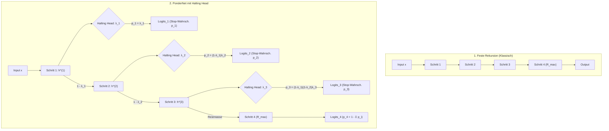
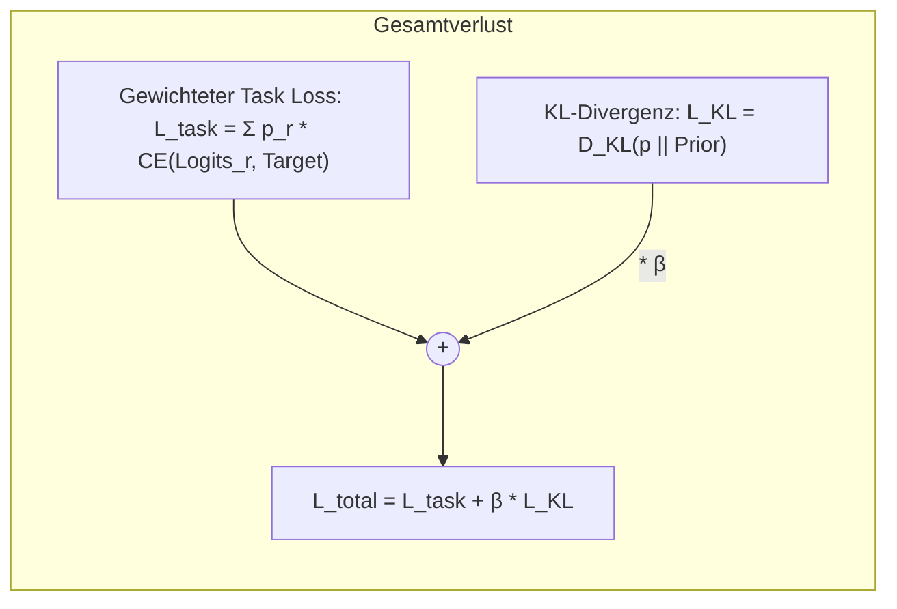

# 🛑 Halting Head & PonderNet in BDH-CQ

In komplexen Aufgaben wie [[Latenter Workspace & Deep Supervision|latentem Reasoning]] oder Sudoku ist nicht jedes Problem gleich schwer:
- Ein **einfaches Sudoku** (z. B. 45 vorgegebene Ziffern) benötigt oft nur 1 bis 2 Verfeinerungsschritte.
- Ein **schweres Sudoku** (z. B. 20 Ziffern mit komplexen Ausschlussmustern) benötigt 6 bis 8 Iterationen im latenten Raum.

Wird für alle Aufgaben eine feste Schrittzahl $R$ erzwungen, verschwendet das Modell entweder Rechenzeit (Overthinking bei einfachen Beispielen) oder hat zu wenig Kapazität für schwere Aufgaben. Der **Halting Head** implementiert **PonderNet (Adaptive Computation Time / ACT)**, wodurch das [[BDH-CQ - Contextual Query|BDH-CQ]] Modell lernt, die Anzahl der Denkschritte pro Aufgabe dynamisch und probabilistisch selbst zu wählen.

---

## 🧠 Konzept & Funktionsweise



---

## 📐 Mathematische Formulierung

In jedem latenten Rekursionsschritt $r \in [1, R_{\max}]$ erzeugt das Netzwerk einen Zwischenzustand $h^{(r)} \in \mathbb{R}^{B \times 1 \times T \times D}$.

### 1. Halte-Wahrscheinlichkeit pro Schritt ($\lambda_r$)
Zuerst wird die Sequenz über die Token-Dimension $T$ gemittelt, um eine globale Repräsentation $\bar{h}^{(r)} \in \mathbb{R}^{B \times D}$ pro Beispiel zu erhalten. Der lineare **Halting Head** berechnet die unbedingte Halte-Wahrscheinlichkeit:

$$\lambda_{i, r} = \sigma\left( W_{\text{halt}} \cdot \bar{h}_i^{(r)} + b_{\text{halt}} \right) \in (0, 1)$$

### 2. Wahrscheinlichkeitsverteilung über den Haltepunkt ($p_r$)
Die Wahrscheinlichkeit, dass die Berechnung **exakt bei Schritt $r$ stoppt**, ergibt sich aus einem Bernoulli-Prozess:

$$p_{i, r} = \lambda_{i, r} \prod_{j=1}^{r-1} (1 - \lambda_{i, j})$$

Für den maximalen Schritt $R_{\max}$ wird die verbleibende Wahrscheinlichkeitsmasse zugewiesen, sodass immer eine echte Wahrscheinlichkeitsverteilung entsteht:

$$p_{i, R_{\max}} = 1 - \sum_{j=1}^{R_{\max}-1} p_{i, j} \quad \implies \quad \sum_{r=1}^{R_{\max}} p_{i, r} = 1$$

---

## 🎯 Verlustfunktion: Task Loss + KL Prior Regularisierung

PonderNet formuliert das Halten als Schätzung unter einem **geometrischen Prior** $p_{\text{prior}} \sim \text{Geom}(\lambda_p)$, um einen Kollaps auf $R=1$ oder $R=R_{\max}$ zu verhindern.



### 1. Probabilistischer Task-Loss ($\mathcal{L}_{\text{task}}$)
Der Cross-Entropy-Verlust für jedes Sample ist der Erwartungswert über alle Schritte:

$$\mathcal{L}_{\text{task}, i} = \sum_{r=1}^{R_{\max}} p_{i, r} \cdot \mathcal{L}_{\text{CE}}\left(\hat{y}_i^{(r)}, y_i\right)$$

### 2. KL-Divergenz-Prior ($\mathcal{L}_{\text{KL}}$)
Mit dem Hyperparameter $\lambda_p \in (0, 1]$ (z. B. $0.2$) wird ein geometrischer Prior definiert:
$$p_{\text{prior}}(r) = (1 - \lambda_p)^{r-1} \lambda_p \quad \text{für } r < R_{\max}, \quad p_{\text{prior}}(R_{\max}) = 1 - \sum_{j=1}^{R_{\max}-1} p_{\text{prior}}(j)$$

Die KL-Divergenz bestraft Abweichungen vom gewünschten Schritt-Budget:
$$\mathcal{L}_{\text{KL}, i} = D_{\text{KL}}(p_i \,\|\, p_{\text{prior}}) = \sum_{r=1}^{R_{\max}} p_{i, r} \log\left(\frac{p_{i, r}}{p_{\text{prior}}(r)}\right)$$

### 3. Gesamt-Loss
$$\mathcal{L} = \frac{1}{B}\sum_{i=1}^B \left( \mathcal{L}_{\text{task}, i} + \beta \cdot \mathcal{L}_{\text{KL}, i} \right)$$

---

## ⚡ Training vs. Inferenz

| Phase | GPU-Ausführung | Mechanismus |
| :--- | :--- | :--- |
| **Training** | **Vollständig synchron:** Alle $B$ Samples laufen $R_{\max}$ Schritte parallel auf der GPU. | Keine CUDA-Branching-Overheads. Soft-Gewichtung über $p_{i, r}$ im Loss steuert die Gradienten pro Sample. |
| **Inferenz (Batch)** | **Synchron mit dynamischer Auswahl:** Pro Sample wird die Vorhersage des wahrscheinlichsten Schritts $r_i^* = \operatorname{argmax}_r p_{i, r}$ gewählt. | Logits werden probabilistisch gemischt: $\hat{y} = \sum_r p_r \hat{y}^{(r)}$. |
| **Inferenz (Single)** | **Echter Frühabbruch:** Die Schleife stoppt, sobald $\sum_{j=1}^r p_j \ge \tau_{\text{halt}}$ (z. B. 0.95). | Maximale Einsparung von FLOPs und Latenz. |

---

## 📊 Metriken & Logging

Während des Trainings werden automatisch folgende Metriken erfasst:
- `ponder/task_loss`: Reiner gewichteter Rekonstruktions-/Klassifikationsverlust.
- `ponder/kl_loss`: Strafterm für Abweichungen von der Prior-Schrittanzahl.
- `ponder/expected_steps`: Die durchschnittlich benötigte Denkzeit $\mathbb{E}[R] = \frac{1}{B}\sum_{i=1}^B \sum_{r=1}^{R_{\max}} r \cdot p_{i, r}$.

---

## ⚙️ Konfiguration in YAML

Die PonderNet-Funktionalität kann in jeder BDH-CQ-Konfigurationsdatei (z. B. `configs/bdh_cq_sudoku.yaml`) aktiviert und gesteuert werden:

```yaml
model:
  name: bdh_cq
  params:
    vocab_size: auto
    n_layer: 6
    n_embd: 256
    n_head: 4
    latent_reasoning_steps: 4             # R_max (maximale Denkschritte)
    loss_schedule: ramp
    
    # --- PonderNet Konfiguration ---
    enable_pondernet: true                # Aktiviert den Halting Head
    ponder_lambda_p: 0.2                  # Prior: Erwartet im Schnitt ~2-3 Schritte
    ponder_beta: 0.01                     # Gewichtung des KL-Divergenz-Loss
    ponder_halt_threshold: 0.95           # Inferenz-Abbruchschwelle
```

---

## 🔗 Verwandte Dokumente & Quellcode

- [[Latenter Workspace & Deep Supervision]]: Grundlagen der rekurrenten latenten Zyklen $H_r$ und Deep Supervision Schedules.
- [[BDH-CQ - Contextual Query]]: Die Gesamtarchitektur mit assoziativem Demonstrationsspeicher.
- [[00 - Index & Übersicht]]: Map of Content für alle BDH-Konzepte.
- Quellcode-Implementierung: [src/model/bdh_cq.py](file:///Users/markuseberl/Markus/Projekte/BDH/src/model/bdh_cq.py)
- Testsuite: [tests/test_pondernet.py](file:///Users/markuseberl/Markus/Projekte/BDH/tests/test_pondernet.py)
