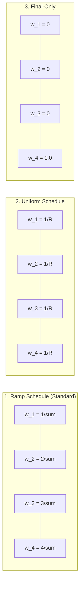

# 🌀 Latenter Workspace & Deep Supervision in BDH-CQ

Herkömmliche Sprachmodelle lösen komplexe mehrstufige Aufgaben (z.B. logische Rätsel, Sudoku, mathematische Beweise) meist über **Chain-of-Thought (CoT)**: Sie erzeugen Zwischengedanken als explizite Tokens in natürlicher Sprache. 

Das [[BDH-CQ - Contextual Query\|BDH-CQ]] Modell verfolgt einen alternativen Ansatz: **Rekurrentes latentes Denken in kontinuierlichen Vektorräumen** kombiniert mit **Deep Supervision**.

---

## 🧠 Latenter Workspace ($H_r$) vs. Token-basiertes CoT

```mermaid
graph TD
    subgraph "Klassisches Token-CoT (Transformer)"
        Prompt1["Problem-Prompt"] --> Tok1["Token: 'Schritt 1...'"]
        Tok1 --> Tok2["Token: 'Schritt 2...'"]
        Tok2 --> Tok3["Token: 'Daher ist...'"]
        Tok3 --> Sol1["Finale Lösung"]
    end
    
    subgraph "BDH-CQ Latenter Workspace"
        Prompt2["Problem-Prompt"] --> H0["H_0 (Initialer Vektor)"]
        H0 -->|"Rekursiver Pass r=1"| H1["H_1 (Latente Verfeinerung)"]
        H1 -->|"Rekursiver Pass r=2"| H2["H_2 (Hypothesenabgleich)"]
        H2 -->|"Rekursiver Pass r=R"| HR["H_R (Konvergierter Zustand)"]
        HR --> Sol2["Finale Lösung (direkt dekodiert)"]
    end
```

| Eigenschaft | Token-basiertes CoT | BDH-CQ Latenter Workspace |
| :--- | :--- | :--- |
| **Medium des Denkens** | Diskrete Wort-/Zeichen-Tokens | Kontinuierliche hochdimensionale Vektoren $H_r \in \mathbb{R}^{B \times 1 \times T \times D}$ |
| **Kontextfenster-Verbrauch** | Sehr hoch (Dutzende bis Hunderte Zwischen-Tokens) | **Null zusätzliche Tokens** |
| **Token-Fehlerrisiko** | Formatierungs- und Syntaxfehler in Zwischenschritten | Robuste Vektorkonvergenz |
| **Skalierbarkeit** | Mehr Tokens = höhere Inferenzzeit & Kosten | $R$ Denkschritte = flexibel skalierbarer Rechenaufwand |

---

## 🔁 Der rekurrente Denkzyklus ($r = 0 \dots R-1$)

Der Zustand $H$ wird mit der ursprünglichen Query-Einbettung initialisiert: $H_0 = x^\star$.

In jeder Denkiteration $r \in [0, R-1]$ durchläuft der Vektor alle $L$ Schichten des Netzwerks:

$$H_{r+1} = \mathcal{F}_{\text{BDH-CQ}}(H_r, \boldsymbol{\rho})$$

Da die Modellparameter über alle $R$ Iterationen **gewichtsgebunden (weight-tied)** sind, wächst die Parameteranzahl des Modells bei $R > 1$ **nicht**, während die effektive Rechentiefe um den Faktor $R$ zunimmt.

---

## 🎯 Multi-Step Deep Supervision & Loss Schedules

Beim Training mit $R > 1$ können rekurrente Schleifen unter instabilem Gradientenfluss oder Moduskollaps leiden. Um dies zu verhindern, wendet BDH-CQ **Deep Supervision** an: Jeder Zwischenzustand $H_r$ wird über den LM-Head projiziert und mit dem Zielvektor verglichen.

$$\text{Logits}_r = H_r \cdot W_{lm\_head}$$
$$\mathcal{L}_{total} = \sum_{r=1}^R w_r \cdot \mathcal{L}_{CE}(\text{Logits}_r, \text{Targets})$$

### Verlust-Gewichtungsschemata (`loss_schedule`):

#### 1. Ramp Schedule (`"ramp"`, Standard)
$$w_r = \frac{r}{\sum_{j=1}^R j} = \frac{2r}{R(R+1)}$$
- **Verhalten**: Frühe Schritte erhalten kleine Gewichte (geben grobe Richtungen vor), spätere Schritte erhalten die höchste Gewichtung (erzwingen maximale Präzision).
- **Vorteil**: Optimale Balance zwischen stabiler Gradientenführung und Fokus auf das Endergebnis.

#### 2. Uniform Schedule (`"uniform"`)
$$w_r = \frac{1}{R}$$
- **Verhalten**: Jeder Schritt wird gleich stark gewichtet.
- **Vorteil**: Zwingt das Modell, bereits in sehr frühen Schritten gute Vorhersagen zu treffen.

#### 3. Final-Only Schedule (`"final_only"`)
$$w_r = \begin{cases} 1 & r = R \\ 0 & r < R \end{cases}$$
- **Verhalten**: Nur die finale Ausgabe wird überwacht.
- **Vorteil**: Maximale Freiheit für interne Repräsentationen in $H_1 \dots H_{R-1}$, jedoch schwerer zu trainieren.

---

## ⚡ Test-Time Compute Scaling

Ein herausragender Vorteil des latenten Workspaces ist die Möglichkeit, **Test-Time Compute Scaling** durchzuführen:
- Ein Modell, das mit $R=2$ oder $R=4$ trainiert wurde, kann zur Inferenzzeit mit $R=6$ oder $R=8$ betrieben werden.
- Dies erlaubt es, schwierigen Testfällen dynamisch mehr Rechenzeit zuzuordnen, ohne das neuronale Netz neu trainieren oder verändern zu müssen.

---

## 🔗 Verwandte Notizen

- [[BDH-CQ - Contextual Query]] – Die vollständige Modellarchitektur.
- [[Assoziatives Gedächtnis & Fast-Weights]] – Zusammenwirken von Gedächtnis und latentem Raum.
- [[Modellvergleich & Benchmarks]] – Vergleich der Denkparadigmen.
