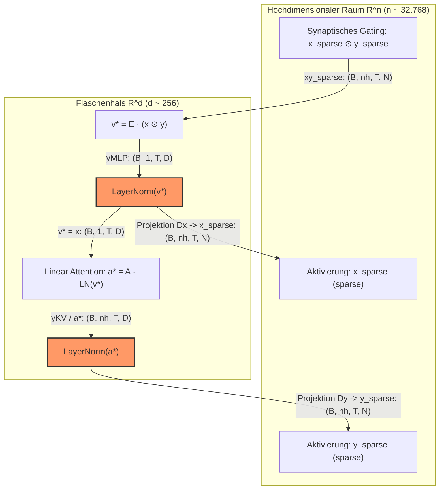

# ⚖️ LayerNorm & Flaschenhals-Dynamik im BDH-Modell

In der BDH-Architekturfamilie (**Baby Dragon Hatchling**) spielen die `LayerNorm`-Schichten eine fundamentale Rolle für die mathematische und numerische Stabilität sowie für die Funktionalität des Modells. 

Im Gegensatz zu klassischen Transformern, die LayerNorm primär als vortrainierte Skalierungs- und Verschiebungsschicht mit lernbaren Parametern ($\gamma, \beta$) vor bzw. nach Aufmerksamkeitsblöcken einsetzen, erfüllt **parameterfreie LayerNorm** in BDH spezifische strukturelle und dynamische Aufgaben im Zusammenspiel zwischen hochdimensionalem Raum $\mathbb{R}^n$ und niedrigdimensionalem Flaschenhals $\mathbb{R}^d$.

---

## 🎯 Die zentralen Aufgaben der LayerNorm

Die `LayerNorm`-Schichten in der Flaschenhals-Dimension $d$ (sowohl am Ausgang des Encoders $E$ als auch am Ausgang der Linear Attention) erfüllen vier zentrale Aufgaben im BDH-GPU-Modell:

### 1. 🛡️ Verhinderung von Norm-Explosionen im Flaschenhals ($\mathbb{R}^d$)
Da das Modell von einer extrem hohen Neuronen-Dimension $n$ (z. B. 32.768) in eine sehr kleine Flaschenhals-Dimension $d$ (z. B. 256) und anschließend wieder zurück projiziert, würden die Vektornormen über Zeitschritte und Schichten hinweg ohne Normierung instabil werden oder divergieren. 

LayerNorm skaliert und zentriert Zwischenzustände wie $v^*$ und $a^*$ **parameterfrei**:

$$\text{LN}(z^*) = \frac{z^* - \mathbb{E}_d[z^*]}{\sigma_d[z^*]}$$

wobei $\mathbb{E}_d$ und $\sigma_d$ jeweils Mittelwert und Standardabweichung entlang der Flaschenhals-Dimension $d$ bezeichnen.

### 2. 🎛️ Kalibrierung für das nachfolgende $\text{ReLU}$-Gating (Denoising)
Die Dekoder $D_x$ und $D_y$ heben die normalisierten Signale aus dem Flaschenhals $\mathbb{R}^d$ zurück in den hochdimensionalen Raum $\mathbb{R}^n$, worauf direkt ein $\text{ReLU}$-Schwellenwert folgt:

$$x = \text{ReLU}(D_x \cdot \text{LN}(v^*)), \quad y = \text{ReLU}(D_y \cdot \text{LN}(a^*))$$

Damit $\text{ReLU}$ wie gewünscht als **Rauschfilter (Denoising-Mechanismus)** wirkt und die für BDH typische hohe Sparsity von **~95 %** erzeugt, müssen die Eingänge in einem strikt definierten, wohlkalibrierten Wertebereich liegen. Ohne LayerNorm würde der Shift der Aktivierungsverteilung dazu führen, dass entweder alle Neuronen feuern (Verlust der Sparsität) oder das Signal abstirbt (*dying ReLUs*).

### 3. 📈 Essenzielle Trainingsstabilität
Die Autoren weisen im Paper *The Dragon Hatchling* (Abschnitt 3.3) explizit darauf hin, dass Modelle in dieser Architektur ohne LayerNorm in der Praxis nicht stabil konvergieren:

> *"Models generally do not train following BDH-GPU without any LayerNorm, but we observed empirically that there is some flexibility as to where these LayerNorms are placed; they can also be moved to the neuron dimension $n$, and they are parameter-free."*  
> — **The Dragon Hatchling, Section 3.3**

Die parameterfreie Normalisierung sichert stabile Gradientenflüsse über tiefe Schichten und rekurrente Rekursionen hinweg.

### 4. 🔀 Parameterfreie Head-Normalisierung
Bei der Verwendung mehrerer Aufmerksamkeitsköpfe ($H$) subdividiert das Modell die Dimension $n$. LayerNorm normalisiert hierbei die Ergebnisse der linearen Attention für jeden Kopf separat:

$$\text{LN}_{\text{head}}(A_h \cdot x)$$

Dies geschieht ohne Einführung zusätzlicher lernbarer Parameter ($\gamma, \beta = \text{None}$), wodurch der Speicher- und Parameter-Footprint minimal bleibt.

---

## 🔬 Flussdiagramm: Einbettung im Datenfluss



---

## 💻 Code-Implementierung (`src/model/bdh.py`)

In PyTorch wird die parameterfreie LayerNorm über `nn.LayerNorm(dim, elementwise_affine=False)` umgesetzt:

```python
# Parameterfreie Normalisierung im Flaschenhals
self.ln_v = nn.LayerNorm(self.config.n_embd, elementwise_affine=False)
self.ln_a = nn.LayerNorm(self.config.n_embd, elementwise_affine=False)
```

---

## 🔗 Verwandte Notizen

- [[BDH - Baby Dragon Hatchling]] – Gesamtarchitektur und Schichtabläufe.
- [[BDH-CQ - Contextual Query]] – Nutzung von LayerNorm im rekurrenten latenten Denkprozess.
- [[RoPE & Sparse Synaptic Gating]] – Synaptische Selektivität und Sparsität.
- [[Modellvergleich & Benchmarks]] – Struktureller Vergleich zu klassischen Transformer-Normalisierungen.
