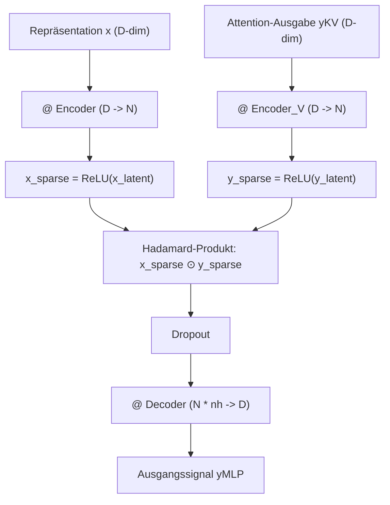

# 🌀 RoPE & Sparse Synaptic Gating in BDH

Zwei zentrale Bausteine der BDH-Architekturfamilie sind:
1. **Quantisierte Rotary Position Embeddings (RoPE)** zur relativen Positionskodierung.
2. **Biologisch inspiriertes Synaptisches Gating ($x \odot y$)** auf hochdimensionalen, dünnbesetzten Zuständen.

---

## 🧭 1. Quantisierte Rotary Position Embeddings (RoPE)

In [[BDH - Baby Dragon Hatchling\|BDH]] und [[BDH-CQ - Contextual Query\|BDH-CQ]] werden Positionen nicht über additive Einbettungen hinzugefügt, sondern durch Rotationen der Merkmalsvektoren im Phasenraum moduliert.

### Frequenzberechnung (`get_freqs`)

Die Basisfrequenzen werden mit einer quantisierten Basis $\theta = 2^{16} = 65536$ berechnet:

$$\text{freqs}(i) = \frac{1}{\theta^{\frac{\lfloor i / q \rfloor \cdot q}{N}} \cdot 2\pi} \quad \text{mit } q=2$$

In Python (`src/model/bdh.py`):
```python
def get_freqs(n, theta, dtype):
    def quantize(t, q=2):
        return (t / q).floor() * q

    return (
        1.0
        / (theta ** (quantize(torch.arange(0, n, 1, dtype=dtype)) / n))
        / (2 * math.pi)
    )
```

### Rotation der Aktivierungsvektoren

Für jeden Zeitschritt $t \in [0, T-1]$ ergibt sich die Phase:
$$\Phi_t = t \cdot \text{freqs}$$
$$\cos(\Phi_t) = \cos(2\pi \cdot (\Phi_t \bmod 1)), \quad \sin(\Phi_t) = \sin(2\pi \cdot (\Phi_t \bmod 1))$$

Der Vektor $v$ wird in Paare aufgeteilt und rotiert:
$$v_{rot} = (-v[..., 1::2], v[..., ::2])$$
$$\text{RoPE}(v) = v \odot \cos(\Phi_t) + v_{rot} \odot \sin(\Phi_t)$$

---

## ⚡ 2. Sparse Synaptic Gating ($x_{sparse} \odot y_{sparse}$)

Klassische Transformer verwenden dichte Multi-Layer-Perceptrons (MLP) mit quadratischen Dimensionen (z.B. $d_{model} \to 4 d_{model} \to d_{model}$). BDH setzt stattdessen auf das Prinzip der **synaptischen Selektivität**:



### Warum $N \gg D$?
- Die Dimension pro Kopf wird drastisch vergrößert ($N = 8192$ bei $D=256$).
- Durch die nachfolgende `ReLU`-Aktivierung wird ein Großteil der Neuronen auf $0$ gesetzt (**hohe Sparsität**).
- Das Hadamard-Produkt $x_{sparse} \odot y_{sparse}$ fungiert als **synaptische Koinzidenzerkennung**: Ein Kanal wird nur dann aktiviert, wenn sowohl das lokale Token ($x$) als auch der durch Aufmerksamkeit gewonnene Kontext ($y$) denselben Kanal ansprechen.

---

## 🔗 Verwandte Notizen

- [[BDH - Baby Dragon Hatchling]] – Gesamtaufbau des Basismodells.
- [[BDH-CQ - Contextual Query]] – Nutzung von RoPE im hybriden Aufmerksamkeitsmodul.
- [[Modellvergleich & Benchmarks]] – Mathematischer Vergleich.
