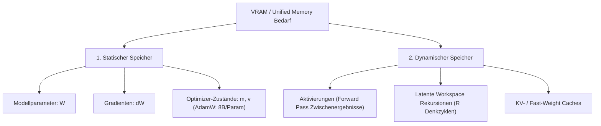
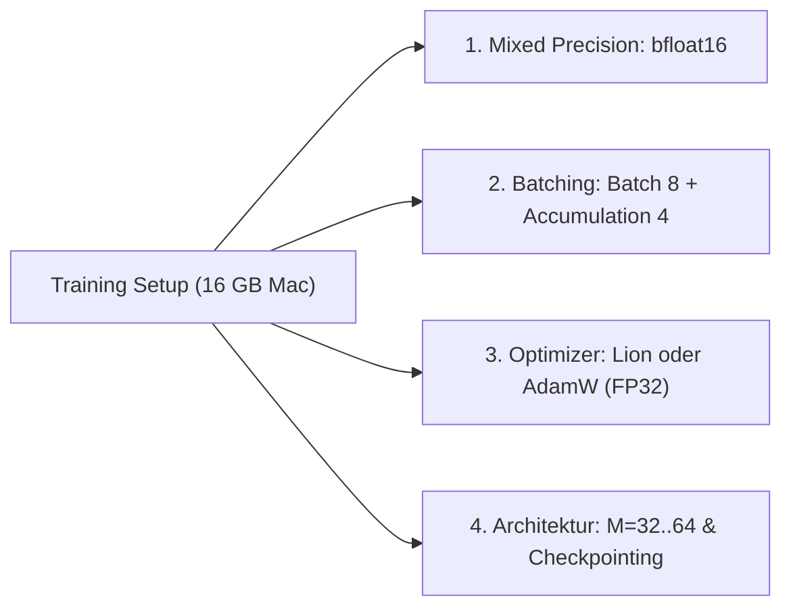

# ⚡ Speicher- & Optimizer-Optimierung für BDH

Diese Notiz dokumentiert die Ursachen des hohen VRAM- und Hauptspeicherbedarfs im **[[BDH - Baby Dragon Hatchling]]** Framework sowie eine detaillierte Analyse von **6 Optimierungsansätzen** für Optimizer, Aktivierungen und Präzision – speziell optimiert für Trainingsumgebungen mit begrenztem Speicher (wie **16 GB Unified Memory** auf Apple Silicon / MPS).

> [!abstract] Das Kernproblem bei BDH
> In BDH führt der Expansionsmultiplikator `mlp_internal_dim_multiplier: 128` zu einer extremen internen Sparsitätsdimension pro Head:
> $$N = \frac{D \cdot M}{n_h} = \frac{256 \cdot 128}{4} = 8192$$
> 
> Der Gesamtspeicher im Training setzt sich aus vier Hauptkomponenten zusammen:
> $$\text{VRAM}_{\text{Gesamt}} = \mathbf{M}_{\text{Modell}} + \mathbf{M}_{\text{Gradienten}} + \mathbf{M}_{\text{Optimizer}} + \mathbf{M}_{\text{Aktivierungen}}$$
> 
> Bei $L=6$ Layern, Batch-Size $32$ und Sequenzlänge $256$ beanspruchen allein die Autograd-Aktivierungen **> 20 GB VRAM**, während ein FP32-AdamW für zusätzliche **8 Byte pro Parameter** sorgt.

---

## 🧭 Speicherkomponenten im Überblick



---

## 🔬 Die 6 Optimierungs-Ideen im Detail

### 1. 8-Bit Optimizer (z. B. `bitsandbytes.optim.AdamW8bit`)

Standard-AdamW speichert für jeden Parameter $p$ das erste Moment $m_t$ (Mittelwert) und das zweite Moment $v_t$ (Varianz) in voller 32-Bit-Präzision (FP32).

> [!info] Funktionsweise
> - **Blockweise Quantisierung**: Tensoren werden in 2048-Element-Blöcke unterteilt. Pro Block wird ein Skalierungsfaktor bestimmt und die Momente werden nichtlinear in 8-Bit-Integers quantisiert.
> - **Dequantisierung im Register**: Vor der Parameteraktualisierung werden die 8-Bit-Werte dynamisch im schnellen SRAM/Register in FP16/FP32 umgerechnet.
> - **Speicherersparnis**: Reduziert den Optimizer-State von **8 Byte/Param auf 2 Byte/Param** (75 % Ersparnis).

$$\begin{aligned}
\text{Memory}_{\text{AdamW (FP32)}} &= 2 \times 4 \text{ Bytes} = 8 \text{ Bytes / Param} \\
\text{Memory}_{\text{AdamW (8-bit)}} &= 2 \times 1 \text{ Byte} + \text{Overhead} \approx 2.05 \text{ Bytes / Param}
\end{aligned}$$

- **Vorteile**: Nahezu verlustfreie Konvergenz im Vergleich zu FP32-AdamW; drastische Ersparnis bei großen Modellen (> 200M Parameter).
- **Herausforderung auf Apple Silicon**: `bitsandbytes` ist primär auf CUDA optimiert. Auf macOS/MPS fehlen native Metal-Quantisierungs-Kernel; Fallbacks auf CPU verlangsamen das Training erheblich.

---

### 2. Lion Optimizer (EvoLved Sign Momentum)

Lion (*auto-discovered by Google Brain*) ersetzt die getrennte Varianzschätzung von Adam durch eine einfache, vorzeichenbasierte Momentumsaktualisierung:

$$\begin{aligned}
c_t &= \text{sign}\big(\beta_1 m_{t-1} + (1 - \beta_1) g_t\big) \\
\theta_t &\leftarrow \theta_t - \eta_t \cdot \big(c_t + \lambda \theta_t\big) \\
m_t &\leftarrow \beta_2 m_{t-1} + (1 - \beta_2) g_t
\end{aligned}$$

> [!tip] Warum Lion ideal für Apple Silicon (MPS) ist
> - **Nur 1 Momentum-Puffer**: Speichert ausschließlich $m_t$. Der Speicherbedarf sinkt auf **4 Byte/Param** (50 % Ersparnis gegenüber AdamW).
> - **100 % nativer PyTorch-Code**: Benötigt keine CUDA/C-Quantisierungs-Kernel und läuft nativ und extrem schnell auf MPS.
> - **Geringerer Rechenaufwand**: Die $\text{sign}(\cdot)$-Operation ist rechengünstiger als $\sqrt{v_t} + \epsilon$.

```python
# Nativer Lion Update-Schritt (vereinfacht)
update = torch.sign(m.mul_(beta1).add_(grad, alpha=1 - beta1))
param.data.add_(update, alpha=-lr).add_(param.data, alpha=-lr * weight_decay)
m.mul_(beta2).add_(grad, alpha=1 - beta2)
```

- **Hyperparameter-Anpassung**: Lion benötigt typischerweise eine **3- bis 10-fach kleinere Lernrate** als AdamW und ein **höheres Weight Decay** (z. B. $0.1$ bis $1.0$).

---

### 3. Adafactor (Faktorisierte Varianzschätzung)

Adafactor eliminiert den quadratischen Speicherbedarf des zweiten Moments $v_t$, indem 2D-Gewichtsmatrizen $W \in \mathbb{R}^{d_1 \times d_2}$ durch Rang-1-Zerlegungen approximiert werden:

$$V \approx \frac{R \cdot C^T}{\mathbf{1}^T R} \quad \text{mit } R \in \mathbb{R}^{d_1}, C \in \mathbb{R}^{d_2}$$

> [!note] Eigenschaften
> - **Speicherreduktion**: Statt $d_1 \times d_2$ Werten werden nur $d_1 + d_2$ Werte gespeichert. Für eine $4096 \times 4096$ Matrix sinkt der Zustand von $16.7\text{ Mio. Floats}$ auf $8192\text{ Floats}$ (> 99 % Ersparnis für das 2. Moment).
> - **Optional ohne 1. Moment**: Kann komplett ohne Momentum betrieben werden (Memory $\to 0$).
> - **Nativ verfügbar**: In `transformers` und gängigen PyTorch-Bibliotheken out-of-the-box ohne Spezial-Kernel implementiert.

---

### 4. Activation Checkpointing (Gradient Checkpointing)

In tiefen BDH-Netzen oder bei vielen latenten Denkschritten ([[Latenter Workspace & Deep Supervision]]) dominiert der **Aktivierungsspeicher**, nicht die Modellgewichte.

> [!important] Recomputation-Prinzip
> Normalerweise speichert PyTorch während des Forward-Passes **alle** Zwischenaktivierungen jedes Layers für die Ableitung in `backward()`.
> 
> Mit `torch.utils.checkpoint`:
> 1. Im **Forward-Pass** werden Zwischenaktivierungen nach Berechnung sofort verworfen. Nur die Layer-Eingänge bleiben im Speicher.
> 2. Im **Backward-Pass** wird der Forward-Pass des jeweiligen Layers **on-the-fly neu gerechnet**.

```python
import torch.utils.checkpoint as checkpoint

class BDHTransformer(nn.Module):
    def forward(self, x):
        for layer in self.layers:
            if self.training and self.use_checkpointing:
                x = checkpoint.checkpoint(layer, x, use_reentrant=False)
            else:
                x = layer(x)
        return x
```

- **Vorteil**: Reduziert den Aktivierungsspeicher um **70 % bis 85 %**.
- **Kosten**: Erhöht die Rechenzeit des Backward-Passes um ca. **20 % bis 30 %**.

---

### 5. Mixed Precision Training (BF16 / FP16 mit Autocast)

Nutzt reduzierte 16-Bit-Fließkommazahlen für Gewichte, Aktivierungen und Gradienten, während numerisch sensible Operationen (z. B. Softmax, Loss, Optimizer-Updates) in FP32 verbleiben.

> [!tip] Bfloat16 vs. Float16 auf Apple Silicon
> - **Bfloat16 (Empfohlen)**: Besitzt denselben 8-Bit-Exponenten wie FP32. Benötigt keinen `GradScaler`, da kein Underflow-Risiko bei Gradienten besteht.
> - **Float16**: Höhere Mantissen-Präzision (10 Bit), benötigt aber `torch.amp.GradScaler`, um numerisches Auslöschen kleiner Gradienten zu verhindern.
> 
> Auf modernen Apple Silicon Chips (M1/M2/M3/M4) bieten die Matrix-Engines native 16-Bit-Beschleunigung.

```python
# Ausführung im Trainer
with torch.autocast(device_type="mps", dtype=torch.bfloat16):
    outputs = model(inputs)
    loss = loss_fn(outputs, targets)

loss.backward()
optimizer.step()
```

- **Ersparnis**: Halbiert den Speicherbedarf für Gewichte, Gradienten und Aktivierungen von **4 Byte auf 2 Byte**.

---

### 6. Gradient Accumulation (Batch-Entkopplung)

Entkoppelt die **statistische Batch-Größe** (notwendig für stabile Gradienten) von der **Hardware-Batch-Größe** (beschränkt durch VRAM).

> [!abstract] Mechanik
> Statt einen großen Batch $B=32$ auf einmal durch das Modell zu schieben, wird er in $K=4$ Micro-Batches à $B_{\mu}=8$ geteilt:
> 
> 1. Für jeden Micro-Batch: Loss berechnen und durch $K$ skalieren ($\mathcal{L}_{\mu} = \frac{\mathcal{L}}{K}$).
> 2. `loss.backward()` akkumuliert die Gradienten in `p.grad`.
> 3. Erst nach $K$ Schritten wird `optimizer.step()` und `optimizer.zero_grad()` aufgerufen.

- **Vorteil**: Null Qualitätsverlust, identische mathematische Updates, Aktivierungsspeicher sinkt exakt um den Faktor $K$.
- Bereits nativ in `src/training/trainer.py` über `gradient_accumulation_steps` konfiguriert.

---

## 📊 Vergleich der 6 Optimierungsmethoden

| Methode | Ziel-Komponente | Speicherersparnis | Rechen-Overhead | Apple Silicon (MPS) Eignung |
| :--- | :--- | :--- | :--- | :--- |
| **1. 8-Bit AdamW** | Optimizer States | ~75 % des Optimizers | Gering (Register Dequant) | ⚠️ Mäßig (fehlende native Metal-Kernel) |
| **2. Lion Optimizer** | Optimizer States | ~50 % des Optimizers | 0 % (sogar schneller) | ⭐ **Hervorragend (100% nativer PyTorch)** |
| **3. Adafactor** | Optimizer States | ~50–75 % des Optimizers | Gering | ⭐ **Hervorragend (nativ unterstützt)** |
| **4. Activation Checkpointing** | Aktivierungen | ~70–85 % der Aktivierungen | +20–30 % Backward | ⭐ **Sehr gut (ermöglicht große Modelle)** |
| **5. Mixed Precision (BF16)** | Gewichte, Grads, Akt. | ~50 % des Gesamtspeichers | 0 % (bis zu 2× schneller) | ⭐ **Hervorragend (Hardware-beschleunigt)** |
| **6. Gradient Accumulation** | Aktivierungen | Linearer Faktor $K$ | 0 % | ⭐ **Hervorragend (Standard-Best-Practice)** |

---

## 💡 Empfohlene Strategie für BDH auf 16 GB Mac

Für das Training im BDH-Projekt wird folgendes Rezept empfohlen:



1. **Aktivierungen begrenzen**: `mlp_internal_dim_multiplier: 32` oder `64` (statt 128) und `batch_size: 8` mit `gradient_accumulation_steps: 4`.
2. **Präzision**: `mixed_precision: true` mit `bfloat16`.
3. **Bei tiefen Reasoning Loops ($R > 3$)**: Activation Checkpointing für die rekurrenten Workspace-Schritte aktivieren.
4. **Optimizer-Wahl**:
   - Für kleine Modelle (< 50M): Standard-AdamW reicht völlig.
   - Wenn Optimizer-Memory eng wird: **Lion** als ersten nativen Ersatz wählen.

---

## 🔗 Verwandte Notizen

- [[00 - Index & Übersicht]] – Hauptübersicht der BDH-Dokumentation
- [[BDH - Baby Dragon Hatchling]] – Architekturdetails und Sparsitäts-Projektionen
- [[BDH-CQ - Contextual Query]] – Latenter Workspace und Fast-Weights
- [[Latenter Workspace & Deep Supervision]] – Iterative Denkschleifen und Recomputation
- [[RoPE & Sparse Synaptic Gating]] – Sparsity-Dimension $N$ und Aktivierungsskalierung
