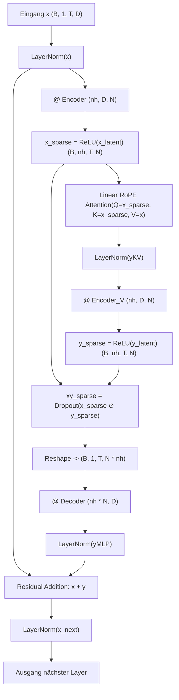

# 🐉 BDH (Baby Dragon Hatchling) Architektur

Das **Baby Dragon Hatchling (BDH)** Modell ist eine alternative neuronale Netzwerkarchitektur, die biologisch plausible Prinzipien wie **hohe Sparsität**, **synaptisches Gating** und **niederrangige rekurrente Interaktionen** mit modernen Aufmerksamkeitsmechanismen kombiniert.

Im Gegensatz zu klassischen Transformer-Architekturen verzichtet BDH auf Standard-Feed-Forward-Netzwerke (FFN) und Multi-Head Attention (MHA) im traditionellen Sinne. Stattdessen projiziert es Eingaben in einen extrem hochdimensionalen Raum, filtert diese über ReLU-Sparsität, wendet lineare RoPE-Aufmerksamkeit an und moduliert die Aktivierungen über ein punktweises Produkt (Hadamard-Produkt).

---

## 🏗️ Mathematische Formulierung & Layer-Ablauf

Sei $x \in \mathbb{R}^{B \times 1 \times T \times D}$ der eingebettete und Layer-Norm-normalisierte Sequenzvektor:
- $B$: Batch-Größe
- $T$: Sequenzlänge (Zeit/Token)
- $D$: Einbettungsdimension (`n_embd`, z.B. 256)
- $n_h$: Anzahl der Köpfe (`n_head`, z.B. 4)
- $M$: Multiplikator für die interne Dimension (`mlp_internal_dim_multiplier`, z.B. 128)
- $N = \frac{D \cdot M}{n_h}$: Interne Dimension pro Kopf (z.B. $\frac{256 \cdot 128}{4} = 8192$)



### 1. Hochdimensionale Kodierung & Sparsität
Der Zustand $x$ wird pro Kopf in einen $N$-dimensionalen Raum projiziert und mittels ReLU sparsifiziert:
$$x_{latent} = x \cdot W_{enc} \quad \text{mit} \quad W_{enc} \in \mathbb{R}^{n_h \times D \times N}$$
$$x_{sparse} = \max(0, x_{latent}) \in \mathbb{R}^{B \times n_h \times T \times N}$$

### 2. RoPE Linear Attention
Die Aufmerksamkeit wird direkt auf den sparsifizierten Repräsentationen mit Rotary Position Embeddings (RoPE) berechnet:
$$QR = \text{RoPE}(x_{sparse}), \quad KR = QR$$
$$A = \text{tril}(QR \cdot KR^T, \text{diagonal}=-1)$$
$$y_{KV} = \text{LayerNorm}(A \cdot x) \in \mathbb{R}^{B \times n_h \times T \times D}$$

> [!note] Kausale Maskierung
> Die Attention-Matrix $A$ verwendet `diagonal=-1`, sodass ein Token strikt nur auf vorangegangene Token zugreift und kein Selbst-Bias auf derselben Position entsteht.

### 3. Zweite Projektion & Synaptisches Gating
Die aufmerksamkeitsmodulierten Vektoren $y_{KV}$ werden erneut in den hochdimensionalen Raum projiziert und via Hadamard-Produkt (Gating) mit $x_{sparse}$ verknüpft:
$$y_{latent} = y_{KV} \cdot W_{enc\_v} \quad \text{mit} \quad W_{enc\_v} \in \mathbb{R}^{n_h \times D \times N}$$
$$y_{sparse} = \max(0, y_{latent})$$
$$xy_{sparse} = \text{Dropout}(x_{sparse} \odot y_{sparse})$$

### 4. Dekodierung & Residuum
Die sparsifizierten Kanäle aller Köpfe werden zusammengeführt und über eine gemeinsame Projektionsmatrix auf die Einbettungsdimension $D$ zurückprojiziert:
$$y_{MLP} = \text{LayerNorm}\left(\text{Reshape}(xy_{sparse}) \cdot W_{dec}\right) \quad \text{mit} \quad W_{dec} \in \mathbb{R}^{(n_h \cdot N) \times D}$$
$$x_{l+1} = \text{LayerNorm}(x_l + y_{MLP})$$

---

## ⚙️ Hyperparameter & Konfiguration (`BDHConfig`)

In `src/model/bdh.py` wird die Konfiguration über die Datenklasse `BDHConfig` gesteuert:

```python
@dataclasses.dataclass
class BDHConfig:
    n_layer: int = 6                       # Anzahl der BDH-Layer
    n_embd: int = 256                      # Einbettungsdimension D
    dropout: float = 0.1                   # Dropout-Wahrscheinlichkeit auf xy_sparse
    n_head: int = 4                        # Anzahl der Aufmerksamkeitsköpfe
    mlp_internal_dim_multiplier: int = 128 # Multiplikator M für die interne Sparsitätsdimension
    vocab_size: int = 256                  # Vokabulargröße
```

### Parameteranzahl & Speicheraufteilung

Für die Standardwerte ($D=256, n_h=4, M=128 \implies N=8192$):
- **Encoder ($W_{enc}$)**: $4 \times 256 \times 8192 \approx 8.39\text{M}$ Parameter
- **Value-Encoder ($W_{enc\_v}$)**: $4 \times 256 \times 8192 \approx 8.39\text{M}$ Parameter
- **Decoder ($W_{dec}$)**: $(4 \cdot 8192) \times 256 = 32768 \times 256 \approx 8.39\text{M}$ Parameter
- **Gesamt pro Layer**: $\approx 25.17\text{M}$ Parameter (bei Parameter-Sharing über Layer hinweg teilt sich dieser Block).

---

## 🔄 Integration & Adapter (`ConfiguredBDH`)

Für das Training über den PyTorch-Trainer ist das Modell als `ConfiguredBDH` in der Modell-Registry registriert:

```python
@MODEL_REGISTRY.register("bdh")
class ConfiguredBDH(BaseModel):
    ...
```

### Kernmethoden:
- `forward(input_ids)`: Validiert die Kontextlänge und liefert die Logits $\hat{y} = x \cdot W_{lm\_head}$.
- `training_step(batch, batch_idx)`: Berechnet `cross_entropy` über die Zielsequenz.
- `generate(idx, max_new_tokens, temperature, top_k)`: Autoregressive Token-Generierung mit Top-K Sampling.

---

## 🔗 Verwandte Notizen

- [[BDH-CQ - Contextual Query]] – Erweiterung mit assoziativem Gedächtnis und latentem Denken.
- [[BDH Transformer Baseline]] – Vergleichbare Standard-Transformer-Implementierung.
- [[RoPE & Sparse Synaptic Gating]] – Details zur Implementierung der Frequenzen und Sparsität.
- [[Modellvergleich & Benchmarks]] – Direkter Leistungs- und Architekturvergleich.
