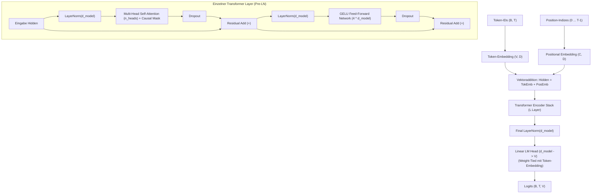

# 🤖 BDH Transformer Baseline

Die **BDH Transformer Baseline** (`BDHTransformer`) ist eine klassische kausale Decoder-Transformer-Architektur. Sie dient innerhalb des BDH-Frameworks als **empirische Kontrollgruppe** und Standard-Vergleichsbasis (Baseline) für alle Experimente und Benchmarks mit [[BDH - Baby Dragon Hatchling]] und [[BDH-CQ - Contextual Query]].

---

## 🏗️ Architekturdetails

Das Modell basiert auf PyTorch's `nn.TransformerEncoderLayer` und implementiert ein modernes **Pre-LayerNorm (Pre-LN)** Design mit kausaler Maskierung:



---

## ⚙️ Technische Parameter & Konfiguration

Die Initialisierung erfolgt über folgende Parameter:

```python
class BDHTransformer(BaseModel):
    def __init__(
        self,
        vocab_size: int | str,        # Größe des Vokabulars V
        context_length: int = 256,    # Maximale Kontextlänge C
        d_model: int = 256,           # Verborgene Dimension D
        n_heads: int = 8,             # Anzahl Aufmerksamkeitsköpfe
        n_layers: int = 6,            # Anzahl Transformer-Layer L
        dropout: float = 0.1,         # Dropout-Rate
        learning_rate: float = 3e-4,  # Lernrate für AdamW
        weight_decay: float = 0.1,    # Weight Decay
    ) -> None:
        ...
```

### Besonderheiten der Implementierung:
- **Kausale Dreiecksmaske**: Eine obere Dreiecksmatrix (`torch.triu(..., diagonal=1)`) verhindert, dass Positionen $t$ Informationen von zukünftigen Tokens $t' > t$ erhalten.
- **Weight Tying**: Die Gewichte des Ausgabeprojektors `lm_head` sind identisch an die Gewichtsmatrix des `token_embedding` gebunden (`self.lm_head.weight = self.token_embedding.weight`), was die Parameteranzahl reduziert und das Sprachmodelllernen regularisiert.
- **GELU-Aktivierung**: Im 4-fachen Feed-Forward-Netzwerk ($4 \cdot d_{model}$) kommt die glatte Gauß'sche Fehlerlineareinheit (GELU) zum Einsatz.

---

## 🎯 Rolle im Experimentierzyklus

| Fragestellung | Was die Transformer-Baseline zeigt | Was BDH / BDH-CQ zeigen |
| :--- | :--- | :--- |
| **In-Context-Skalierung** | Skaliert mit $O(T^2)$ Rechenzeit und linearem KV-Cache-Wachstum. | BDH-CQ akkumuliert Demonstrationen in feste Fast-Weight-Matrizen ($O(1)$ bzgl. Demo-Länge). |
| **Denkleistung (Reasoning)** | Benötigt autoregressive Ketten (Chain-of-Thought / CoT) als Tokens. | BDH-CQ iteriert latent im kontinuierlichen Vektorraum über $R$ Schritte. |
| **Sparsität & biologische Plausibilität** | Dichte Gewichtsmatrizen und quadratische Softmax-Attention. | Dünnbesetzte hochdimensionale Zustände ($N \gg D$) und Hadamard-Gating. |

---

## 🔗 Verwandte Notizen

- [[BDH - Baby Dragon Hatchling]] – Die biologisch inspirierte Kernarchitektur.
- [[BDH-CQ - Contextual Query]] – Erweiterung um assoziatives Gedächtnis und latente Schleifen.
- [[Modellvergleich & Benchmarks]] – Gesamte Vergleichsmatrix aller Modelle.
