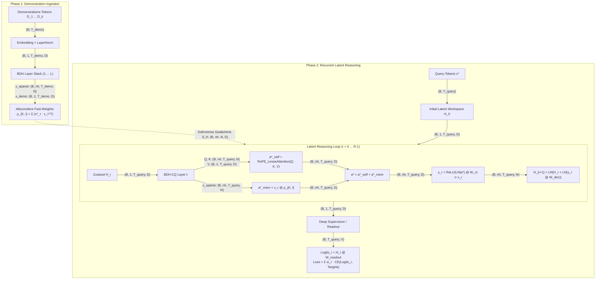

# 🧬 BDH-CQ (Baby Dragon Hatchling - Contextual Query)

Die **BDH-CQ** Architektur erweitert das Basis-[[BDH - Baby Dragon Hatchling]]-Modell um zwei grundlegende Fähigkeiten:
1. **Assoziatives Gedächtnis über Fast-Weights**: Ingestion von In-Context-Demonstrationen ohne expliziten Key-Value-Cache (KV-Cache).
2. **Rekursives latentes Schließen (Latent Reasoning)**: Iterative Verfeinerung eines kontinuierlichen Vektorzusammenhangs über $R$ Durchläufe (*Latent Reasoning Steps*), ohne diskrete Denk-Tokens (*CoT Trace*) erzeugen zu müssen.

---

## 🏛️ Architekturübersicht

BDH-CQ operiert in zwei Phasen: Der **Demonstrations-Konditionierung** und der **rekurrenten Query-Verarbeitung**.



---

## 🔬 Mathematische Formulierung

### 1. Ingestion von Demonstrationen & Assoziative Fast-Weights
Gegeben sei eine Sequenz von $K$ Demonstrationsbeispielen $D = \{(x_t, y_t)\}_{t=1}^K$ mit Länge $T_{demo}$. 

Für jeden Layer $l \in [1, L]$ wird während des Vorwärtsdurchlaufs eine synaptische Schnellgewichtsmatrix $\boldsymbol{\rho}_{K, l}$ akkumuliert:
$$\boldsymbol{\rho}_{K, l} = \sum_{\tau=1}^{T_{demo}} x_{demo\_sparse, \tau, l}^T \cdot x_{demo, \tau, l} \quad \in \mathbb{R}^{B \times n_h \times N \times D}$$

> [!important] $O(1)$ Inferenz-Komplexität bezüglich In-Context-Länge
> Nach Abschluss der Demonstrationsphase wird $\boldsymbol{\rho}_{K, l}$ eingefroren ($S_K = \{\boldsymbol{\rho}_{K, 1}, \ldots, \boldsymbol{\rho}_{K, L}\}$). Bei nachfolgenden Inferenz-Schritten über Abfragen $x^\star$ skaliert der Rechenaufwand nicht mit der Länge der Demonstrationen, da diese in einer festen Matrixgröße gebunden sind.

---

### 2. Rekurrente Denkzyklen im latenten Raum ($H_r$)
Für eine Abfragesequenz $x^\star$ wird der latente Workspace $H_0 = x^\star$ initialisiert. Das Netzwerk führt $R$ rekursente Denkzyklen ($r = 0, \dots, R-1$) über alle $L$ Layer aus:

Für jeden Denkzyklus $r$ und Layer $l$:
1. **Projektion & Sparsifizierung**:
   $$x_{r, l} = \max(0, H_{r, l} \cdot W_{enc}) \in \mathbb{R}^{B \times n_h \times T_{query} \times N}$$
2. **Hybride Aufmerksamkeit (Spatial Self-Attention + Memory Retrieval)**:
   $$a_{self}^* = \text{RoPE\_Attention}(Q=x_{r, l}, K=x_{r, l}, V=H_{r, l})$$
   $$a_{mem}^* = x_{r, l} \cdot \boldsymbol{\rho}_{K, l} \in \mathbb{R}^{B \times n_h \times T_{query} \times D}$$
   $$a^* = a_{self}^* + a_{mem}^*$$
3. **Synaptisches Gating & Residual-Update**:
   $$y_{r, l} = \max(0, \text{LayerNorm}(a^*) \cdot W_{enc\_v})$$
   $$xy_{r, l} = \text{Dropout}(x_{r, l} \odot y_{r, l})$$
   $$y_{MLP} = \text{Reshape}(xy_{r, l}) \cdot W_{dec}$$
   $$H_{r, l+1} = \text{LayerNorm}(H_{r, l} + \text{LayerNorm}(y_{MLP}))$$

---

### 3. Multi-Step Deep Supervision & Loss Schedules

Um den Gradientenfluss durch $R$ rekurrente Denkiterationen zu stabilisieren, unterstützt BDH-CQ **Deep Supervision**. Hierbei wird der Vorhersageverlust über alle Zwischenschritte $r$ gewichtet summiert:

$$\mathcal{L}_{total} = \sum_{r=1}^R w_r \cdot \text{CrossEntropy}(\text{Logits}_r, \text{Targets})$$

#### Verlust-Gewichtungspläne (`loss_schedule`):

| Schema | Formel für Schritt $r \in [1, R]$ | Eigenschaft |
| :--- | :--- | :--- |
| **`"ramp"`** *(Standard)* | $w_r = \frac{r}{\sum_{j=1}^R j} = \frac{2r}{R(R+1)}$ | Spätere Denkschritte erhalten linear höhere Gewichte; erzwingt Verfeinerung. |
| **`"uniform"`** | $w_r = \frac{1}{R}$ | Alle Zwischenschritte tragen gleichmäßig zum Verlust bei. |
| **`"final_only"`** | $w_r = \begin{cases} 1 & r = R \\ 0 & r < R \end{cases}$ | Nur der finale Zustand $H_R$ wird überwacht (reines End-to-End). |

---

## ⚙️ Konfiguration & Parameter (`BDHCQConfig`)

In `src/model/bdh_cq.py` ist die Konfiguration als `BDHCQConfig` definiert:

```python
@dataclasses.dataclass
class BDHCQConfig:
    n_layer: int = 6                       # Anzahl der Layer (L)
    n_embd: int = 256                      # Einbettungsdimension (D)
    dropout: float = 0.1                   # Dropout
    n_head: int = 4                        # Köpfe (nh)
    mlp_internal_dim_multiplier: int = 128 # Multiplikator M (N = D * M // nh)
    vocab_size: int = 256                  # Vokabulargröße
    latent_reasoning_steps: int = 1        # Rekurrente Denkschritte R
    loss_schedule: str = "ramp"            # 'ramp' | 'uniform' | 'final_only'
```

---

## 💻 Code-Auszug & Wichtigste Methoden

### `encode_contextual_memory(demo_idx)`
```python
def encode_contextual_memory(self, demo_idx: torch.Tensor) -> list[torch.Tensor]:
    """Ingestiert Demonstrationen sequenziell und erzeugt pro Layer rho_{K, l}."""
    ...
```

### `forward(idx, targets, demo_len, contextual_memory, latent_reasoning_steps, ...)`
Unterstützt 3 Betriebsmodi:
1. **Separates Gedächtnis**: Übergabe von `contextual_memory=[...]` direkt an eine Query-Sequenz.
2. **Kombinierte Sequenz**: Übergabe von `demo_len=T_demo` in einem einheitlichen Batch-Tensor.
3. **Standard-Durchlauf**: Ohne Demonstrationen mit reinem latenten Denken ($R \ge 1$).

---

## 📈 Vorteile von BDH-CQ

1. **Kein KV-Cache-Wachstum**: Demonstrationen belegen konstanten Speicher $\mathcal{O}(L \cdot n_h \cdot N \cdot D)$, unabhängig davon, ob 5 oder 500 Demonstrationsbeispiele präsentiert werden.
2. **Adaptive Denktiefe bei Inferenz (Test-Time Compute)**: Die Anzahl der Denkschritte $R$ kann zur Inferenzzeit dynamisch erhöht werden (z.B. von $R=1$ auf $R=4$), um schwierigere Aufgaben zu lösen, ohne das Modell neu zu trainieren.
3. **Kein Token-Verbalisierungszwang**: Komplexe Ableitungsschritte finden in kontinuierlichen hochdimensionalen Vektoren statt, wodurch das Modell nicht auf Token-Formatierungsvorgaben eingeschränkt ist.

---

## 🔗 Verwandte Notizen

- [[BDH - Baby Dragon Hatchling]] – Die zugrunde liegende Basisarchitektur.
- [[Assoziatives Gedächtnis & Fast-Weights]] – Vertiefte Betrachtung der synaptischen Schnellgewichte.
- [[Latenter Workspace & Deep Supervision]] – Vertiefte Analyse der Denkschleifen und Verlustkurven.
- [[Modellvergleich & Benchmarks]] – Vergleich aller Architekturen.
