# ⚖️ Modellvergleich & Benchmarks

Dieser Leitfaden vergleicht die drei im Repository implementierten Modellarchitekturen:
1. **[[BDH - Baby Dragon Hatchling]]**
2. **[[BDH-CQ - Contextual Query]]**
3. **[[BDH Transformer Baseline]]**

---

## 📊 Umfassende Vergleichsmatrix

| Eigenschaft | [[BDH - Baby Dragon Hatchling\|BDH]] | [[BDH-CQ - Contextual Query\|BDH-CQ]] | [[BDH Transformer Baseline\|Transformer]] |
| :--- | :--- | :--- | :--- |
| **Architekturtyp** | Dünnbesetztes Gating-Netzwerk | Dünnbesetzt + Assoziatives Gedächtnis + Latenter Workspace | Standard Kausales Pre-LN Decoder-Modell |
| **Aufmerksamkeitsmechanismus** | Lineare RoPE Attention auf $x_{sparse}$ | Hybride Attention (Spatial RoPE + Fast-Weight Retrieval $\rho$) | Standard Softmax Multi-Head Attention (MHA) |
| **Positionskodierung** | Quantisierte RoPE ($2^{16}$) | Quantisierte RoPE ($2^{16}$) | Gelernte absolute Positionseinbettungen |
| **Nichtlinearität / FFN** | Synaptisches Hadamard-Gating ($x_{sparse} \odot y_{sparse}$) | Synaptisches Hadamard-Gating ($x_{sparse} \odot y_{sparse}$) | $4\times d_{model}$ Feed-Forward mit GELU |
| **Interne Dimension** | $N = \frac{D \cdot M}{n_h} \gg D$ ($N=8192$) | $N = \frac{D \cdot M}{n_h} \gg D$ ($N=8192$) | $d_{ff} = 4 \cdot D$ ($1024$) |
| **In-Context-Mechanismus** | Standard Kontextfenster | Assoziative Fast-Weights $\boldsymbol{\rho}_{K, l}$ (Kein KV-Cache nötig) | Key-Value Cache ($O(T)$ Speicher) |
| **Denkprozesse (Reasoning)** | Autoregressive Token-Kette (CoT) | **Latenter Workspace ($R$ Schritte)** ohne Token-Generierung | Autoregressive Token-Kette (CoT) |
| **Supervision / Training** | Standard Next-Token-Loss | **Deep Supervision** (Multi-Step mit `ramp`/`uniform`) | Standard Next-Token-Loss |
| **Inferenzkomplexität (Demos)** | $O(T_{demo}^2)$ | **$O(1)$ bzgl. Demonstrationslänge** (konstante Matrixgröße) | $O(T_{demo}^2)$ / $O(T_{demo})$ mit KV-Cache |

---

## 🔬 Tiefgehender Architekturvergleich

```mermaid
graph TD
    subgraph "Standard Transformer"
        T1["Eingang: h_0"] -->|"h: (B, T, D)"| T2["Softmax MHA (D x D)"]
        T2 -->|"attn_out: (B, T, D)"| T3["GELU FFN (D x 4D x D)"]
        T3 -->|"ffn_out: (B, T, D)"| T4["Token CoT Reasoning"]
    end
    
    subgraph "BDH Basis"
        B1["Eingang: x"] -->|"x: (B, 1, T, D)"| B2["Projektion: x @ W_enc"]
        B2 -->|"x_sparse: (B, nh, T, N)"| B3["RoPE Linear Attention"]
        B3 -->|"yKV: (B, nh, T, D)"| B4["Synaptisches Gating: x_sparse ⊙ y_sparse"]
        B4 -->|"xy_sparse: (B, 1, T, N * nh)"| B5["Decoder Projektion: xy @ W_dec"]
    end
    
    subgraph "BDH-CQ"
        C1["Demonstrationen"] -->|"demo_idx: (B, T_demo)"| C2["Synaptische Fast-Weights ρ_{K, l}"]
        C3["Query"] -->|"x_query: (B, 1, T_query, D)"| C4["Latenter Workspace H_r"]
        C2 -.->|"Gedächtnis ρ_{K, l}: (B, nh, N, D)"| C4
        C4 -->|"H_r (R Durchläufe): (B, 1, T_query, D)"| C5["Deep Supervision Readout"]
    end
```

---

## 📈 Laufzeit- und Speichercharakteristik

### 1. Inferenz mit vielen Demonstrationen (Few-Shot Prompting)
- **Transformer**: Der KV-Cache wächst linear mit jedem zusätzlichen Demonstrationsbeispiel. Bei $K=50$ Beispielen belegt der Cache signifikant VRAM und die Attention-Berechnung verlangsamt sich quadratisch ohne Caching.
- **BDH-CQ**: Alle $K$ Demonstrationen werden einmalig sequenziell komprimiert und in die synaptischen Fast-Weights $\boldsymbol{\rho}_{K,l} \in \mathbb{R}^{n_h \times N \times D}$ geschrieben. Bei nachfolgenden Queries ist der Inferenzaufwand **völlig unabhängig von der Anzahl der Demonstrationen**.

### 2. Denkkomplexität vs. Token-Kosten
- **Transformer & BDH**: Komplexes Denken erfordert das Generieren langer "Chain-of-Thought" (CoT) Token-Sequenzen. Dies verbraucht Kontextlänge, erhöht die Latenz und birgt die Gefahr von Formatierungsfehlern.
- **BDH-CQ**: Das Modell denkt in $R$ kontinuierlichen Durchläufen im hochdimensionalen latenten Workspace $H_r$. Zur Testzeit kann $R$ einfach heraufgesetzt werden (*Test-Time Compute Scaling*), um die Performanz bei kniffligen Aufgaben (z.B. Sudoku, logische Rätsel) zu steigern.

---

## 💡 Entscheidungshilfe: Welches Modell für welches Szenario?

| Szenario | Empfohlenes Modell | Begründung |
| :--- | :--- | :--- |
| **Standard-Sprachmodellierung** (z.B. Shakespeare, WikiText) | **[[BDH - Baby Dragon Hatchling\|BDH]]** oder **[[BDH Transformer Baseline\|Transformer]]** | Standard-Benchmark zum Vergleich von Sprachfluss und Perplexität. |
| **In-Context Few-Shot Tasks** (viele Beispiele) | **[[BDH-CQ - Contextual Query\|BDH-CQ]]** | Keine KV-Cache-Explosion; extrem schneller Abruf aus $\boldsymbol{\rho}$. |
| **Logische Rätsel & Multi-Step Reasoning** (z.B. Sudoku, ARC) | **[[BDH-CQ - Contextual Query\|BDH-CQ]]** | Profitiert direkt von $R > 1$ latenten Denkschritten und Deep Supervision. |
| **Methodische Validierung & Ablationsstudien** | **[[BDH Transformer Baseline\|Transformer]]** | Dient als neutrale Kontrollgruppe für wissenschaftliche Veröffentlichungen. |

---

## 🔗 Verwandte Notizen

- [[BDH - Baby Dragon Hatchling]]
- [[BDH-CQ - Contextual Query]]
- [[BDH Transformer Baseline]]
- [[Assoziatives Gedächtnis & Fast-Weights]]
- [[Latenter Workspace & Deep Supervision]]
